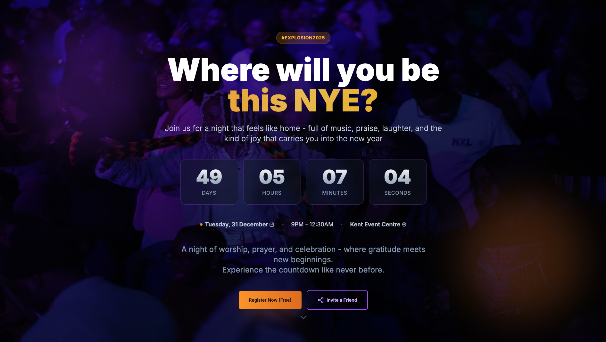

# Run and deploy GWCX Landing page

This contains everything you need to run the site locally.

## Run Locally

**Prerequisites:**  Node.js

1. Install dependencies:
   `npm install`
2. Run the app:
   `npm run dev`
